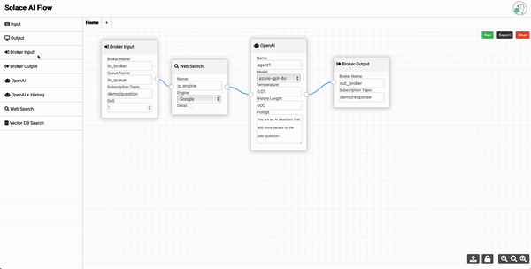

# Solace AI Flow

Solace AI Flow enables you to effortlessly create and run AI and data flows using the Solace AI Connector.

## Features
- **No Code, Drag & Drop**: Design AI and data flows effortlessly without needing any programming skills or knowledge of the Solace AI Connector and Solace broker.
- **Support Multiple Flows**: Create and connect multiple data flows using the Solace broker.
- **Scalability**: Easily add new agents through the user interface to support more complex AI use cases.
- **One-Click Deployment**: Deploy and run workflows with a single click.
- **Extract and upload workflows**: Save workflows for future use by extracting and uploading them as needed.

## License
MIT License
